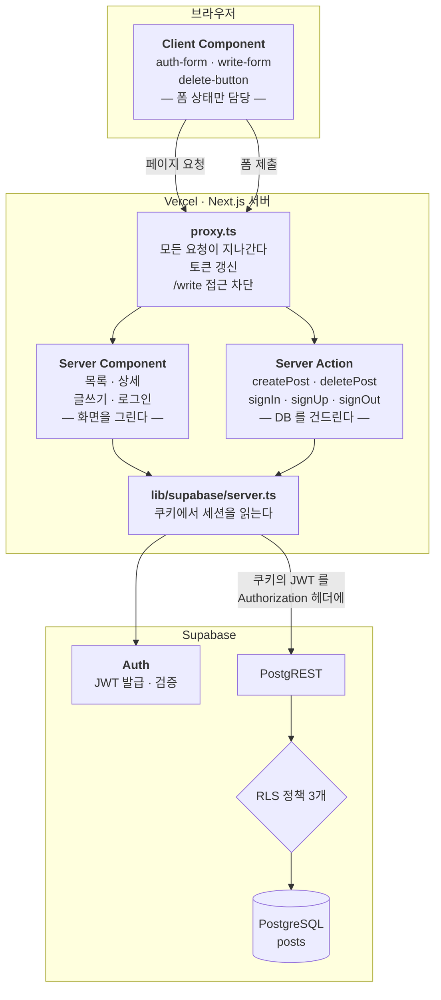
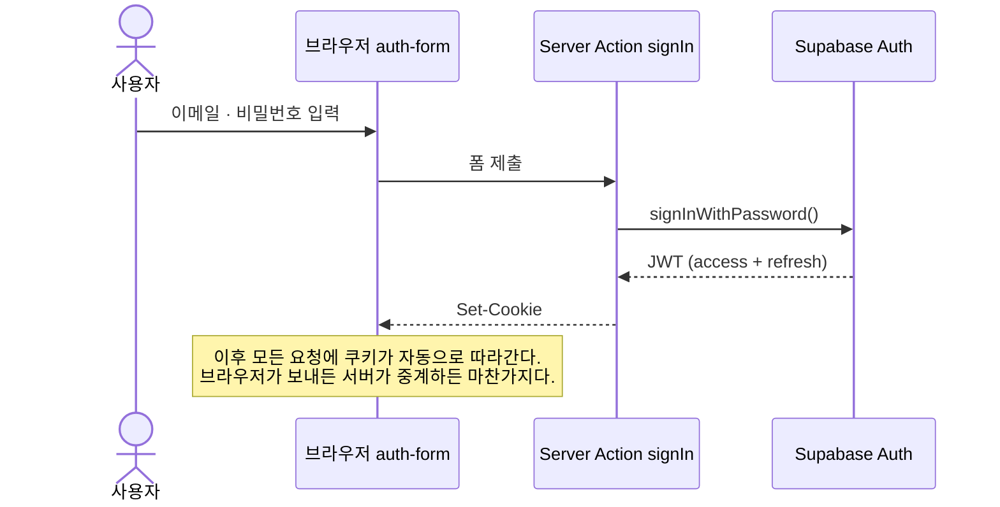
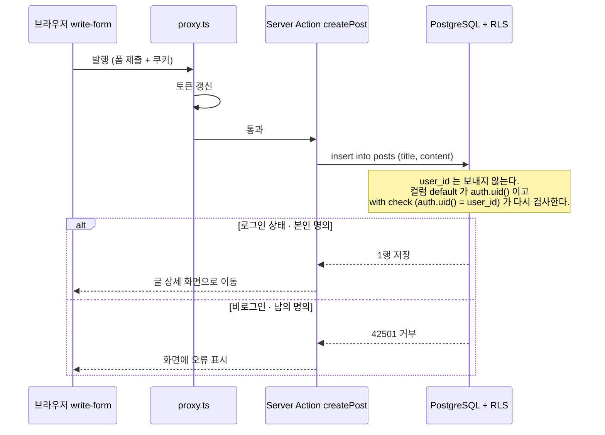
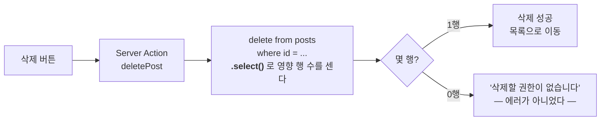
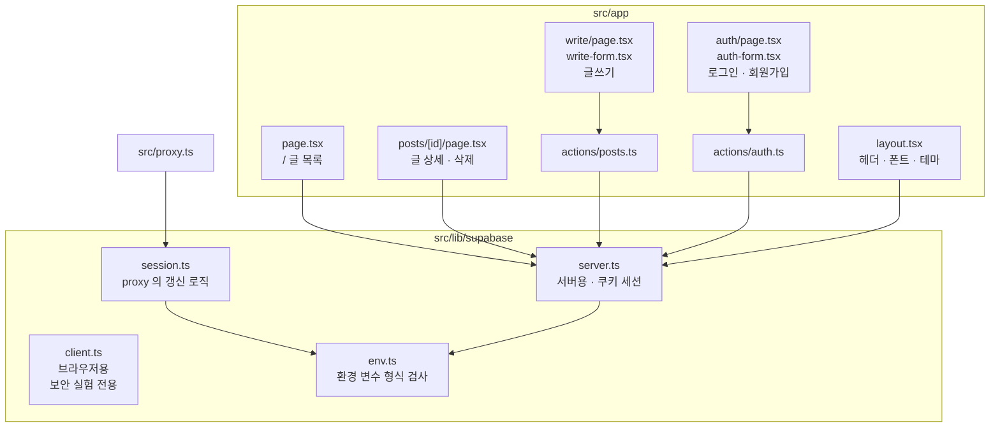

# 아키텍처

이 저장소에 실제로 구현된 구조다. GitHub 에서 그대로 렌더링된다.

---

## 1. 전체 그림

핵심은 **데이터 접근이 전부 서버 쪽에 있다**는 것이다.
브라우저는 화면만 그리고, 수파베이스와는 한 번도 직접 말하지 않는다.

> **브라우저에서 Supabase 로 가는 화살표가 없다.**
> 그래서 anon key 가 클라이언트 번들에 들어가지도 않는다
> (빌드 후 `.next/static` 을 뒤져도 0건). 다만 그게 방어선은 아니다 —
> anon key 는 원래 공개용이고, 진짜 방어선은 RLS 하나다.

---

## 2. 로그인 — 출입증은 쿠키에 산다

명세에 빠져 있던 부분이다. 토큰을 브라우저 `localStorage` 에 두면
서버가 그것을 볼 수 없고, 서버에서 `auth.uid()` 가 NULL 이 되어
RLS 정책 3개 중 2개가 항상 실패한다.

`proxy.ts` 가 매 요청마다 이 토큰을 갱신한다.
그래서 만료돼도 "브라우저는 로그인, 서버는 로그아웃" 같은 어긋남이 생기지 않는다.

---

## 3. 글쓰기 — RLS 가 판정하는 지점

---

## 4. 삭제 — 실패가 아니라 "0행"

여기가 가장 헷갈리는 지점이다. RLS 로 막힌 DELETE 는 **에러를 내지 않는다.**
`using` 조건에 맞지 않는 행은 애초에 그 사용자에게 보이지 않으므로,
"조건에 맞는 행이 없음" = 정상 종료 = 0행이 된다.

`.select()` 를 빼면 에러가 없으니 성공으로 착각하게 되고,
**아무것도 지우지 않고 '삭제되었습니다'라고 말하는 UI** 가 된다.

---

## 5. 파일과 역할

`client.ts` 는 정상 경로에서 쓰지 않는다.
`docs/security-experiment.md` 의 06절 실험에서만 쓴다.

---

## 6. 명세와 달라진 곳

| 명세 (REV 0.1) | 이 구현 | 이유 |
| --- | --- | --- |
| `/write` 전체가 Client Component | 폼만 Client, DB 호출은 Server Action | 명세의 완료 기준과 충돌 |
| 세션 저장소 언급 없음 | 쿠키 (`@supabase/ssr`) + proxy | 없으면 서버에서 `auth.uid()` 가 NULL |
| 정책 3개 | 정책 3개 + 명시적 GRANT | 권한과 RLS 는 서로 다른 층 |

자세한 근거는 [`spec-review.md`](./spec-review.md).
